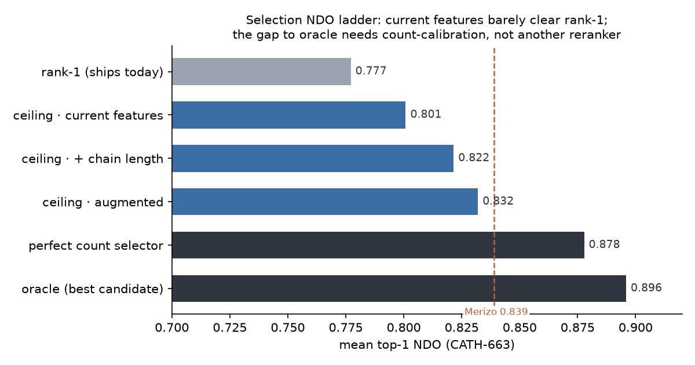
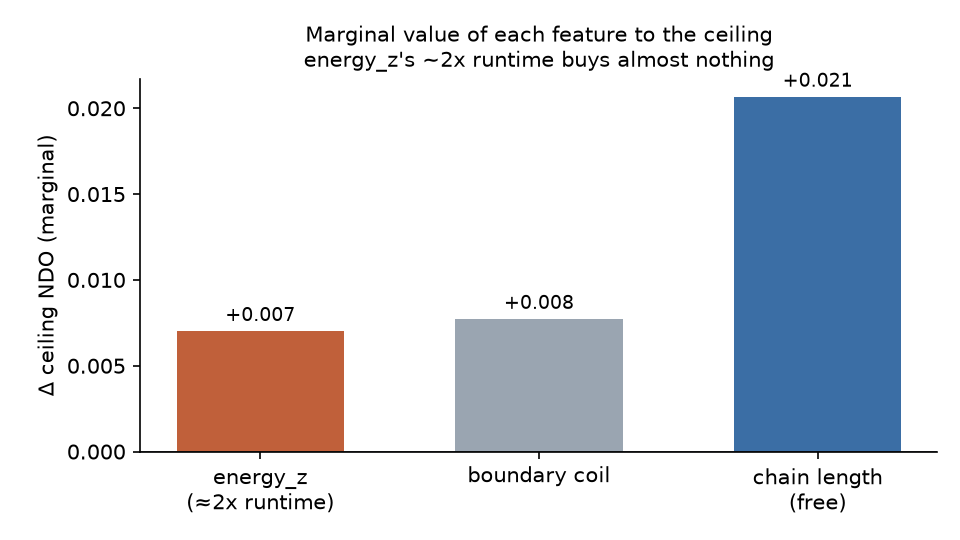
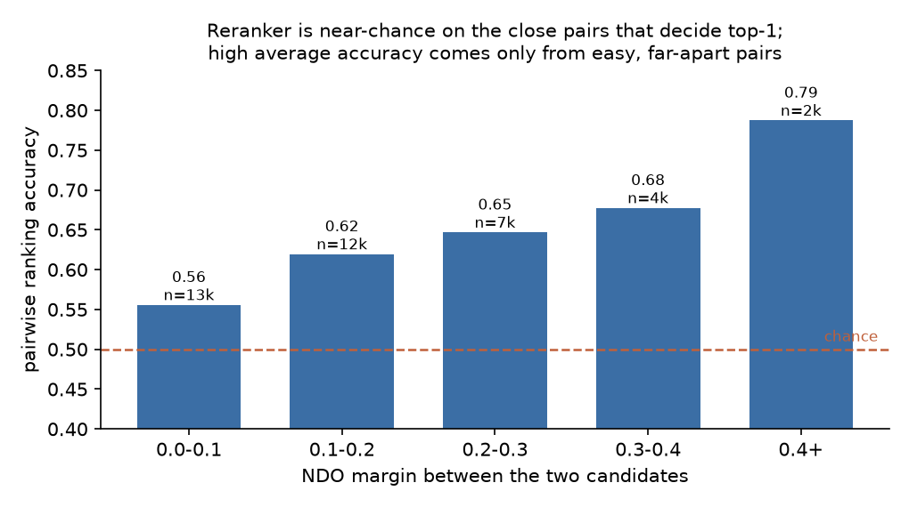

# Why SWORD2's rank-1 selection loses ~0.12 NDO — a diagnosis

**Question.** SWORD2 generates an excellent pool of candidate domain partitions
(its *oracle* beats Merizo), but the single partition it ships as rank-1 leaves
~0.12 NDO on the table. Two attempts to close that gap by re-ranking candidates
have failed. Before building a third, this diagnosis asks *why* selection fails —
using the candidate features and per-candidate ground-truth scores the benchmark
already produces — so the fix is chosen from evidence.

**Verdict (one line).** The current candidate features are the wall: a strong,
chain-cross-validated model over all of them reaches only **0.801** top-1 NDO —
barely above rank-1's 0.777 and far below the 0.896 oracle. Another reranker on
these features cannot work. The lever is **feature engineering for domain-count
calibration** (chain length alone lifts the ceiling to 0.822); `energy_z`, the
expensive feature, is worth +0.007 and should be dropped from selection.

Reproduce: `benchmark/.venv/bin/python -m benchmark.diagnose_selection
--figures-dir benchmark/diagnostics` (numbers below are from
`benchmark/data/diagnosis_results.json`; CATH-663, n=663; 95% CIs by
entry-level bootstrap).

---

## Where things stand (mean over CATH-663)

| tool / variant | NDO | d_count_acc | boundary_f1_10 | IoU |
|---|---|---|---|---|
| **sword2-rust** rank-1 (ships) | 0.777 | 0.670 | 0.573 | 0.777 |
| sword2-rust **oracle** (best candidate) | **0.896** | 0.810 | 0.711 | 0.893 |
| sword2-rust oracle_s (best right-count) | 0.881 | **0.953** | 0.716 | 0.889 |
| merizo (deep learning) | 0.839 | 0.745 | 0.620 | 0.846 |
| chainsaw (deep learning) | 0.724 | 0.737 | 0.224 | 0.782 |

Generation is not the problem — the oracle (0.896) already beats Merizo. The
entire recoverable gap is *selection*.

---

## 1. The gap is ~50/50 count vs within-count — and rank-1 under-segments

Splitting oracle − rank-1 (0.119) by the domain count SWORD2 chose:

| component | NDO | share |
|---|---|---|
| **within-count** (better partition at the *same* count) | 0.0615 | 51.8% |
| **count** (a *different* count is better) | 0.0573 | 48.2% |

Both matter. Getting the count right is not sufficient on its own, but it is
half the prize — and it is highly reachable: a right-count candidate exists for
**99.7%** of chains, yet rank-1 picks the right count only **67.0%** of the time.

The count errors are one-sided — rank-1 **systematically under-segments**:

```
predicted − true domains:   -6:2   -2:61   -1:148   0:444   +1:8
mean −0.413    under 31.8%   exact 67.0%   over 1.2%
```

This is the same under-segmentation bias that sank the Phase-B logistic reranker
— except here it is the *default* `distance_model` selector exhibiting it.

## 2. No trivial rule beats rank-1; a perfect count selector reaches 0.878

Mean top-1 NDO of cheap selectors (bootstrap 95% CI):

| selector | NDO |
|---|---|
| oracle (ceiling) | 0.896 [0.888, 0.904] |
| **true count, then best** (perfect count selector) | **0.878 [0.868, 0.888]** |
| rank-1 (current) | 0.777 [0.761, 0.794] |
| fewest domains | 0.773 |
| lowest density_min | 0.548 |
| highest max_cr | 0.540 |
| most domains | 0.537 |
| **modal predicted count** | **0.521** |

Two things stand out. A **perfect count selector recovers most of the gap
(0.878)** — count calibration is where the NDO is. And **"modal count" is the
*worst* policy (0.521)** — which matters in §5, because that is exactly the
policy the trained reranker leaned into.

## 3. The current features are the wall (the centerpiece)

Best top-1 NDO a strong model (gradient-boosted trees, 5-fold **grouped by
chain** so nothing leaks) can reach, picking argmax on held-out chains:



| feature set | ceiling (top-1 NDO) |
|---|---|
| current 8 features | **0.801 [0.786, 0.816]** |
| current + chain length | 0.822 [0.807, 0.836] |
| current + chain length + rel_max_cr (augmented) | 0.832 [0.818, 0.846] |
| — for reference: perfect count | 0.878 |
| — for reference: oracle | 0.896 |

A perfect model over the current features recovers only **~0.024** of the 0.119
gap. This is a *feature* ceiling, not a *model* ceiling — the same model, given
one free feature (chain length), immediately gains +0.021. That control is the
crux: **both prior rerankers were doomed by the feature set, not just by their
training objective or data size.**

### Feature marginal value — `energy_z` does not earn its ~2× runtime



Leave-one-feature-out on the ceiling:

| feature | marginal Δ ceiling | cost |
|---|---|---|
| chain length | **+0.021** | free |
| boundary coil fraction | +0.008 | free |
| **energy_z** | **+0.007** | **~2× runtime** (per-candidate Z-score) |

`energy_z` is the single most expensive feature to compute and among the least
valuable. Dropping it from selection loses 0.007 NDO and roughly halves runtime.

## 4. Per-feature signal — which features separate the best candidate

AUC of each feature for "is the oracle-best candidate", and Spearman ρ vs NDO:

| feature | AUC | \|AUC−0.5\| | ρ(NDO) |
|---|---|---|---|
| max_cr | 0.158 | 0.342 | −0.199 |
| num_domains | 0.235 | 0.265 | −0.182 |
| modal_count_distance | 0.235 | 0.265 | −0.183 |
| density_min | 0.754 | 0.254 | +0.117 |
| min_size | 0.752 | 0.252 | +0.113 |
| mean_density | 0.741 | 0.241 | +0.201 |
| **energy_z** | 0.320 | 0.180 | −0.150 |
| **boundary_coil_fraction** | 0.535 | **0.035** | +0.047 |

The strongest single signal (max_cr, AUC 0.158) points the *opposite* way to how
`distance_model` uses it — because the best candidate usually has *more* domains
(hence lower max_cr), the mirror image of the under-segmentation bias.
`boundary_coil_fraction` carries essentially no signal (AUC 0.535); `energy_z`
carries weak signal (0.180).

## 5. Autopsy — how 75% pairwise accuracy still regressed top-1

Reconstructing the trained pairwise reranker's decisions on all 663 chains:

- reranker top-1 NDO **0.676 [0.661, 0.691]** — reproduces the regression (vs
  rank-1 0.777).
- overall pairwise accuracy **0.622**, but broken down by how far apart the two
  candidates' NDO is:



| NDO margin | pairwise accuracy | n pairs |
|---|---|---|
| 0.0–0.1 | **0.556** | 13,335 |
| 0.1–0.2 | 0.620 | 12,571 |
| 0.2–0.3 | 0.647 | 7,710 |
| 0.3–0.4 | 0.678 | 4,320 |
| 0.4+ | 0.787 | 2,991 |
| decisive (true-best vs runner-up) | **0.625** | — |

The model is **near-chance (0.556) on the close pairs that actually decide the
top-1 pick**, and its headline accuracy comes only from easy, far-apart pairs.
Average pairwise accuracy is the wrong objective for a top-1 selector.

The learned weights explain the behaviour: `modal_count_distance` dominates
(−0.798), pulling picks toward the modal count — the 0.521-NDO policy from §2 —
while `max_cr` gets a *negative* weight (−0.391), inverted from how it works in
`distance_model`.

---

## Bug found and fixed: the candidate-feature field offset

Both the training-dump writer and the live reranker parsed the pipe-delimited
measure line off by one field (`sword2-lib/src/sword/mod.rs`): they read
`density_min` from field 4 (which is `mean_cr` ≡ 0) and `mean_density` from field
5 (the real `density_min`), never capturing the real `mean_density` (field 6).

Consequence: the reranker trained with **one dead constant-0 feature** — visible
in `pairwise_reranker_weights.json`, where `density_min`'s weight is exactly
`0.0`. Training and inference were consistent, so this is not the whole story,
but it wasted a feature slot and hid a real signal. The default `distance_model`
selection reads field 5 correctly and was **unaffected**; only the off-by-default
reranker and the dump were touched by the fix. All Rust tests pass (80/80).

---

## Recommendation for the next plan

The plan's fork resolves to the **feature-engineering** branch, not another
reranker:

1. **Do not build a third reranker on the current features.** Their ceiling
   (0.801) is essentially rank-1; no objective or dataset fixes that.
2. **Engineer count-calibration features.** Chain length alone lifts the ceiling
   to 0.822; a perfect count selector reaches 0.878. Add cheap structural
   predictors of the *number* of domains (chain length, secondary-structure
   content, radius of gyration / contact order) and target the systematic −0.41
   under-segmentation directly.
3. **Drop `energy_z` from selection** — it buys +0.007 NDO for ~2× runtime.
   `boundary_coil_fraction` (AUC 0.035) can go too.
4. **If a learned selector is used, optimize a top-1 / listwise objective** on the
   close, decisive pairs — not average pairwise accuracy.
5. **Ceiling of this whole effort is the 0.896 oracle.** Beating that requires
   improving candidate *generation*, which is out of scope here.

---

## Count-calibration A/B (2026-07-03)

Task: test the analytical `--use-count-calibration` selector on held-out CATH-663
after fitting `expected_ndom = 1.236372 + 0.003362 * n_residues` on CATH-17287.
Baseline is the default off path (`sword2-rust` optimal): NDO 0.777158,
d_count_acc 0.669683, mean count bias -0.413273.

| lambda | NDO | delta NDO | d_count_acc | count bias | boundary_f1_20 | changed partitions |
|---:|---:|---:|---:|---:|---:|---:|
| 0.02 | 0.778688 | +0.001530 | 0.675716 | -0.401207 | 0.625887 | 15 |
| 0.05 | 0.784445 | +0.007287 | 0.708899 | -0.360483 | 0.640423 | 44 |
| **0.10** | **0.788930** | **+0.011772** | **0.749623** | **-0.277526** | **0.659504** | **100** |
| 0.20 | 0.786871 | +0.009714 | 0.775264 | -0.197587 | 0.673316 | 151 |

Winning lambda by mean NDO is 0.10. Paired bootstrap CI for the NDO delta is
**[+0.006996, +0.016661]**, and per-entry win/tie/loss is **69/564/30**. The
d_count_acc delta is **+0.079940** with paired bootstrap CI **[+0.055807,
+0.104072]**.

Gate decision: keep the flag off by default. The paired result is clearly
positive, but the literal absolute-mean NDO gate does not clear: lambda 0.10's
mean NDO CI is **[0.773935, 0.803858]**, whose lower bound is below
baseline mean - 0.002 (= 0.775158). The module and CLI flag remain useful for
experimentation, but default output stays unchanged.
